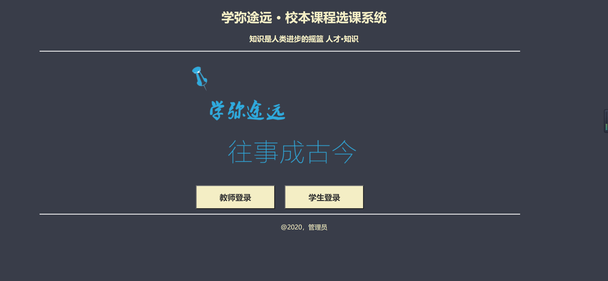
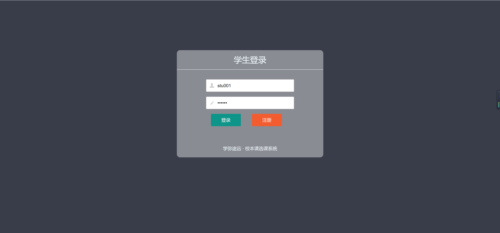
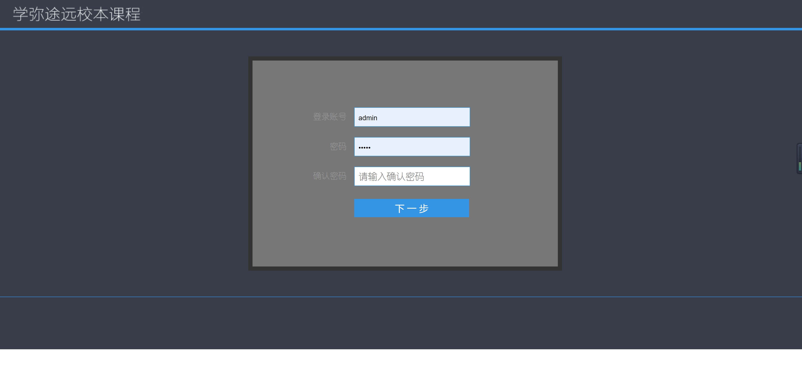
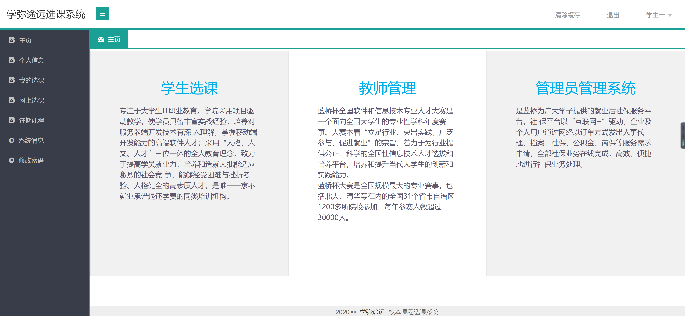
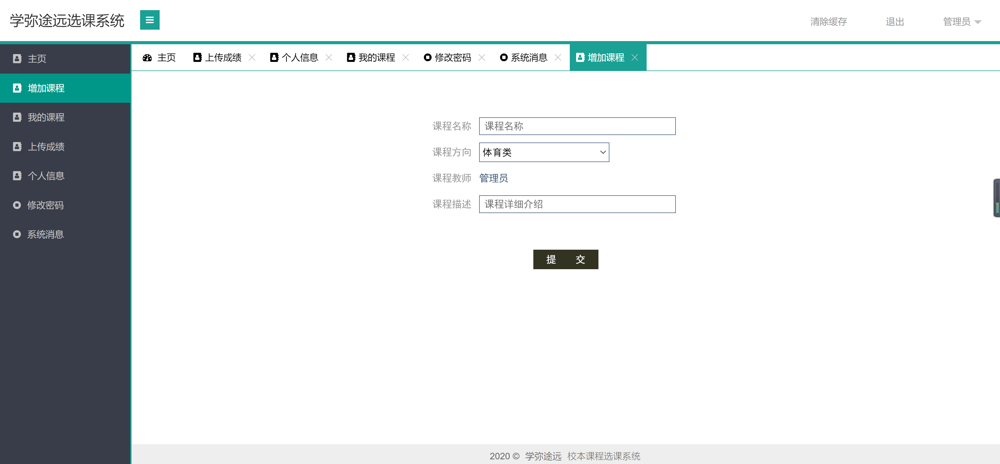
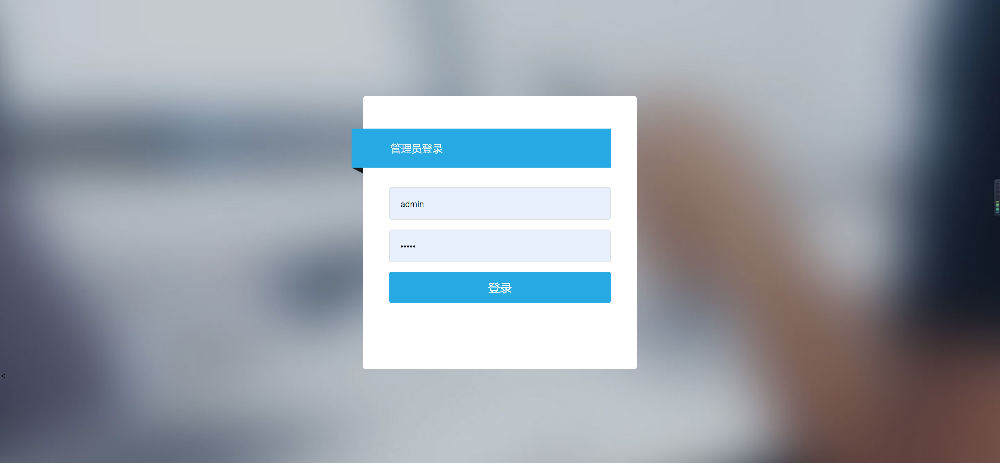

<h1 align="center">学生选课管理系统1</h1>

## 简介
学生选课管理系统：角色分为学生、教师、管理员；功能包括课程查询、选课退课、个人信息管理、课程添加与管理、系统消息通知。    --计算机毕业设计源码；毕设源码；java毕业设计源码

## 联系方式

<h3 align="center">获取完整代码与数据库文件 + 微信：bysj5151 QQ: 86050149 QQ群: 783742310</h3>

<h3 align="center">可帮忙远程部署 包运行成功！提供远程部署、修改代码、设计文档指导、代码讲解等服务！</h3>

## 功能介绍（完整见运行截图）
学生：基本功能包括登录、查询课程、选择和退选课程、查看已选课程和课程时间表。用户界面设计简洁，包含导航栏、课程列表、选课按钮和用户信息显示区，方便浏览和管理个人选课信息。  
教师：通过教师登录入口，教师可以管理课程内容，指定课程教师，并输入课程描述。系统提供增加课程功能，以管理和更新课程信息，提升课程教学质量和学生就业能力。  
管理员：需要通过安全入口进行登录，能够管理和维护选课系统，包括用户账号管理和系统公告发布。管理员可执行课程添加和成绩上传等操作，确保系统正常运行和课程数据的准确性。

## 运行截图

本代码来源于网络,仅供学习参考使用!

